# Building the Wild Rydes Backend Components Layer

In this module, you will deploy backend application components to AWS. These
backend components include AWS Lambda functions, API Gateway Endpoints and a
DynamoDB table. You will also create the IAM polices and roles required by
these components.

There are two ways to complete this module.  For learning purposes, we
recommend that workshop participants step through the Console instructions
while deploying the primary Ireland region, and then for time reasons, use the
provided CloudFormation instructions to quickly set up the second Singapore
region during module 3.

Both sets of instructions are provided – simply expand your preferred path.

<strong>Console step-by-step instructions (expand for details)</strong>

The following objects will be used as you create the resources in the console for this module:

* `wild-rydes-dynamodb-get.json` - This is the policy needed in order to read
  from DynamoDB using the `tickets-get.js` and `health-check.js` Lambda functions
* `wild-rydes-dynamodb-post.json` - This is the policy needed in order to write
  to DynamoDB using the `tickets-post.js` Lambda function
* `wild-rydes-dynamodb-replication.json` - This is the policy needed in order
  to use DynambDB Streams to replicate to a second region using the `tickets-replicate.js` Lambda function
* `tickets-replicate.js` Lambda function to replicate new DynamoDB records to our failover region
* `health-check.js` - Lambda function for checking the status of our application health
* `tickets-get.js` - Lambda function triggered by API Gateway to put application data into DynamoDB
* `tickets-post.js` - Lambda function triggered by API Gateway to read application data from DynamoDB

There are several steps needed to deploy the API and Lambda functions via the
console. The basic steps are:

1. Create the appropriate IAM policies and roles our four AWS Lambda functions
2. Create the required Amazon DynamoDB table
3. Create the four AWS Lambda functions
4. Create the Amazon API Gateway for the primary application region
5. Testing to ensure our backend components are all working as expected

Let’s go ahead and create all the needed polices and roles for our workshop

## 1. Create IAM Policies and Roles

Log into the AWS Console then select the **IAM** service. Now select
**Policies** from the left and click on the **Create policy** button.  Then
select the *JSON* tab and paste the code below into the editing window.

Download policy: [TicketGetPolicy](wild-rydes-dynamodb-get.json)

Click on **Review Policy**

Name your policy `TicketGetPolicy` and click **Create policy**

Now repeat these exact same steps two more times in order to create the
following two additional polices that will be needed during the workshop.

**Download policy**: [TicketPostPolicy](wild-rydes-dynamodb-post.json)

**Download policy**: [TicketReplicatePolicy](wild-rydes-dynamodb-replication.json)

Next you will create the three roles that correspond to the three polices that
were just created. Each of these roles will be used by a different Lambda
function thereby limiting the permissions of each function. This follows an
AWS Best Practice of granting [least privilege](http://docs.aws.amazon.com/IAM/latest/UserGuide/best-practices.html#grant-least-privilege).

In the Console, select the **IAM** service and choose **Roles** from the left,
and click on the “Create role” button:

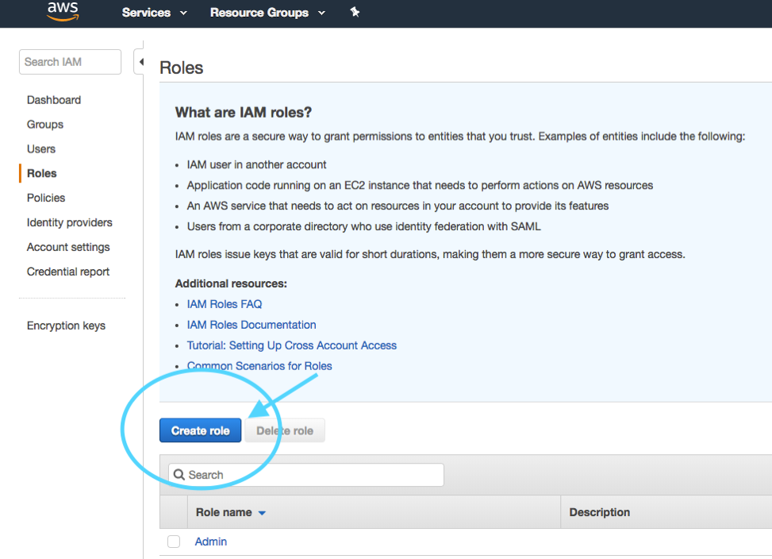

Select the type of “AWS Service” and choose Lambda from the list below then
select **Next: Permissions**.

Find the `TicketGetPolicy` policy you just created on the next screen
and select **Next: Review** (Hint: Use the *Customer Managed* filter)

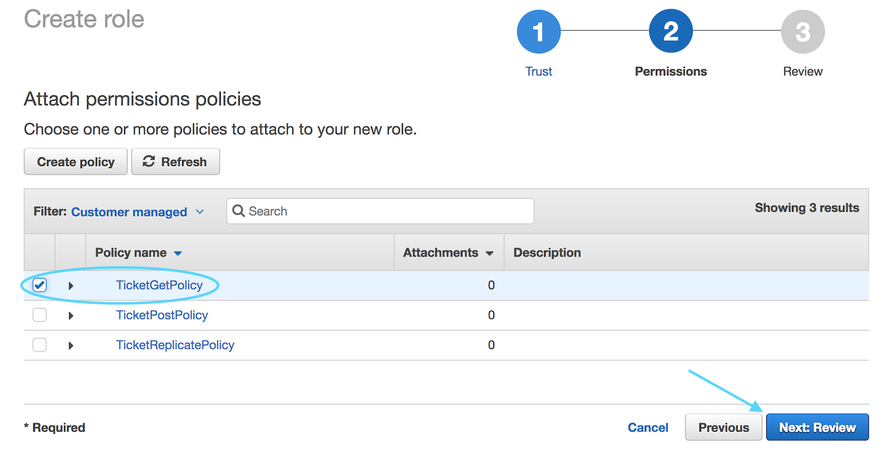

On the next screen, enter `TicketGetRole` for the Role Name and select **Create role**

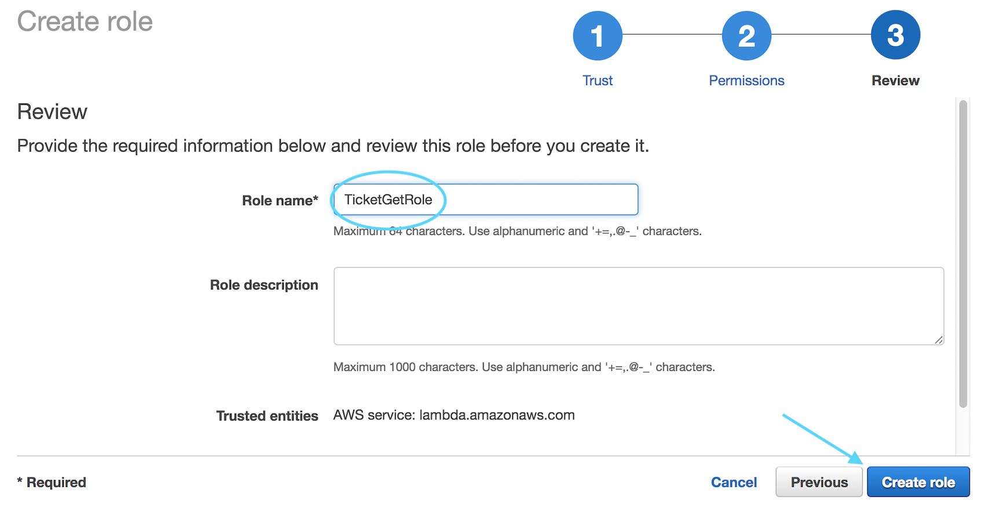

Repeat the same steps two more times, this time creating the role for
`TicketPostRole` and `TicketReplicateRole` and attaching
the corresponding policy you created earlier.

## 2. Create the DynamoDB Table

Next we will create the DynamoDB Table for our application data. Ensure you
are set to Ireland (eu-west-1) in the upper right corner of the console. If
you mistakenly create the DynamoDB table in the wrong region, the application
will not work.

In the console, open **DynamoDB** (it can be found under Database).  Select
**Create Table**. Your screen may be slightly different depending on whether
this is your first DynamoDB table in this region or not.

For the table name, enter `SXRTickets` and enter `id` as the Primary Key
Partition Key and then click **Create**. That’s all that is required for now
to set up the table.

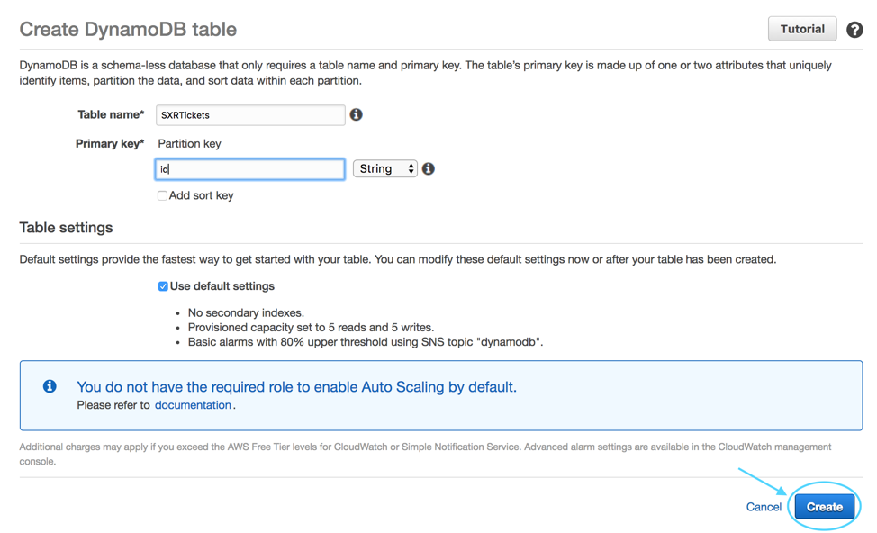

## 3. Create Four Lambda functions

Next, you will create four Lambda functions. First, navigate to **Lambda** in
the console (again ensuring you are still in the Ireland region) and click
**Create a function**

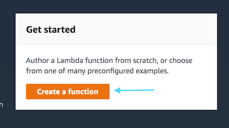

Next select “Author from scratch”

Name your first function `TicketGetFunction` and assign the role with the **matching** name you created previously to it and click **Create function**

Ensure the runtime is `Node.js 6.10`.  If it isn’t, simply select it.

For the Handler, enter `tickets-get.handler` and then paste the following code into the editor you see on your screen:

[TicketGetFunction](tickets-get.js)

Next, under `Environment Variables`, enter they key **TABLE_NAME** and the value **SXRTickets**

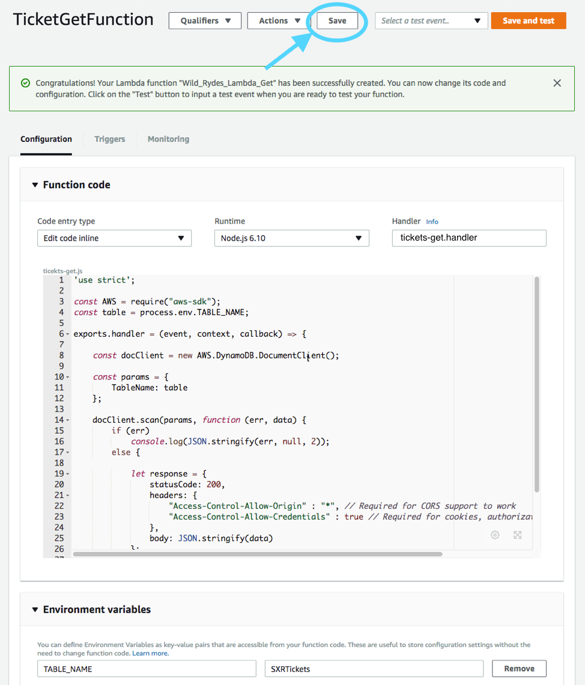

Once everything is set correctly, click **Save** near the top center of the screen.

We still need to create three more lambda functions.  All of them use `Node.js 6.10` as the runtime.  Repeat the same steps you used above.  The table below provides the information needed for all four functions.  Note that you have already done the first one.

| Function Name          | Handler Name          | Execution Role                  | Env Var Key   | Env Var Value  |
| ---------------------  | --------------------- | ------------------------------- | ------------- | -------------- |
| [TicketGetFunction](tickets-get.js)  | tickets-get.handler   | TicketGetRole           | TABLE_NAME    | SXRTickets     |
| [TicketPostFunction](tickets-post.js)  | tickets-post.handler   | TicketPostRole           | TABLE_NAME    | SXRTickets     |
| [TicketReplicateFunction](tickets-replicate.js)         | tickets-replicate.handler          | TicketReplicateRole | TABLE_NAME    | SXRTickets     |
|                        |                       |                                 | TARGET_REGION | ap-southeast-1 |
| [SXRHealthCheckFunction](health-check.js) | health-check.handler  | TicketGetRole           | TABLE_NAME    | SXRTickets     |

## 4. Create API Gateway Endpoint

In the console, under Application Services, open Amazon API Gateway and click on **Get Started**.  Click on **OK** if you are given a *Create Example API* dialogue.

Select **New API** and enter the API Name of `wild-rydes-api` and choose the Endpoint Type of *Regional* and then click **Create API**

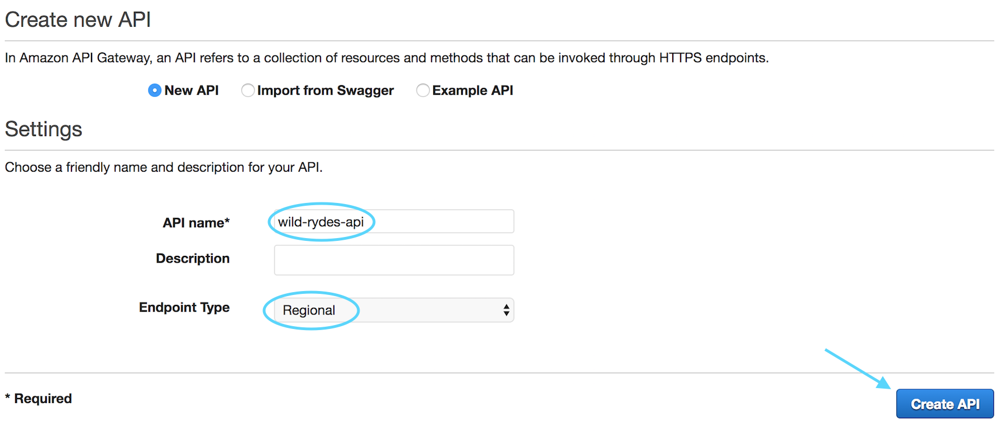

Next, from the *Actions* drop-down, choose **Create Resource** and name the resource `ticket` and select the *Enable API Gateway CORS* option and then click **Create Resource**

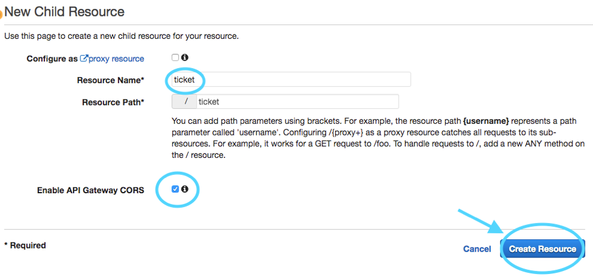

Repeat the same steps one more time, this time creating the resource `health`.  Ensure this resource is at the same level (directly below the root) as `ticket`

Next we will create two methods – one for GET and one for POST

Select `ticket` under *resources*, and from the *Actions* drop-down select **Create Method** and then choose `GET` as your first method and select the check-box to confirm creation:

Keep *Lambda Function* selected, enable *Use Lambda Proxy Integration* and choose `eu-west-1` as the Lambda Region and then start typing in the Lambda Function box and choose *TicketGetFunction* and then click **Save**

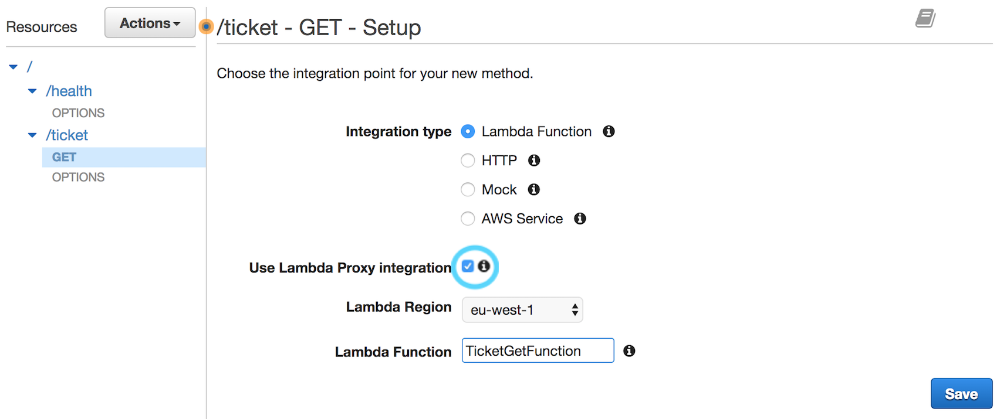

Click OK when asked to *Add Permission to Lambda Function*

Repeat this step one more time but choose the POST method this time. Ensure you choose *TicketPostFunction* as your function this time.

Last we will create a `GET` method under the `health` resource.  You will select the *SXRHealthCheckFunction* for the Lambda function.

Again, click **OK** when asked to *Add Permission to Lambda Function*

Finally, we will enable Cross-Origin.
Select `ticket` under *resources*, and from the *Actions* drop-down select **Enable CORS**

Simply Accept the Default Settings and click on the **Enable CORS and Replace Existing CORS Headers** button:

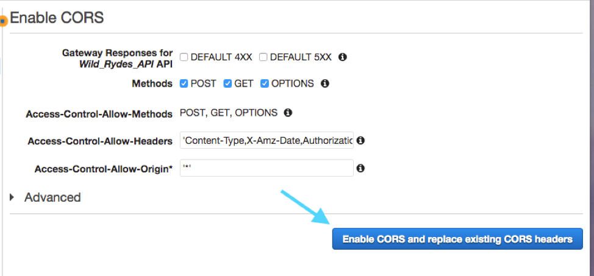

Click **Yes, replace existing values** if prompted.

Repeat the same step once more time, this time choosing `health` as the resource.

Next we will deploy the API – this is done from the “Actions” pull-down, selecting *Deploy API*

Then select *New Stage* for Deployment Stage and enter the Stage Name of `prod` and click **Deploy**.  Note that this needs to be all lowercase or you will run into problems later on.

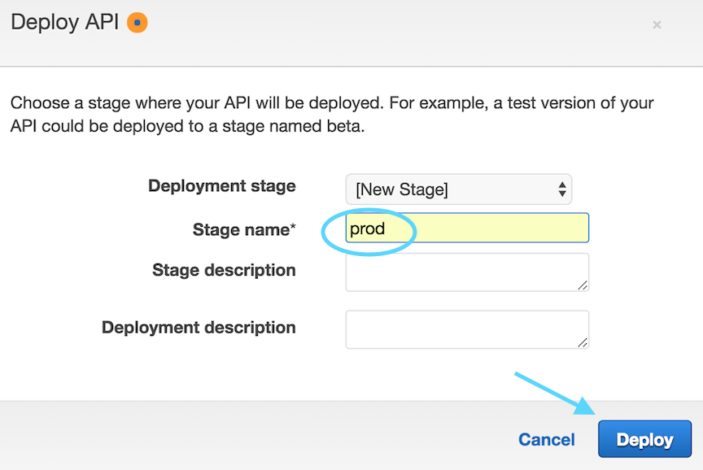

You have now completed the setup of all the API and backend components needed for your primary region

## 5. Test your API Gateway Endpoints

While still in API Gateway, select **Stages** from the left menu under your
API Endpoint.  Next, expand "prod", and select `GET` from the *ticket*
resource.

You'll see a link to your API EndPoint. **Click** on the link and you should
see something like the below in your browser if the test is successful:

    {
        "statusCode":200,
        "headers": "Access-Control-Allow-Origin",
        "Access-Control-Allow-Credentials":true,
        "body":"{"Items":[],"Count":0,"ScannedCount":0}"
    }

You can also peform the same test but select `GET` from the *health* resource
instead.  You should get something like the following in your browser:

    {
        "region":"eu-west-1",
        "message":"Successful response reading from DynamoDB table."
    }

<strong>CLI step-by-step instructions (expand for details)</strong>

Navigate to the `api` folder within your local Git repository and take a look at the files within. You will see three files

* `wild-rydes-api.yaml` – This is a CloudFormation template (using SAM syntax) that describes the infrastructure needed to for the API and how each component should be configured.
* `tickets-get.js` – This is the Node.js code required by our Lambda function needed to retrieve tickets from DynamoDB
* `tickets-post.js` – This is the Node.js code required by our second Lambda function to create new tickets in DynamoDB
* `tickets-replicate.js` – This is the Node.js code that replicates dynamodb data to another region.

There is no modification necessary to this application code so we can go ahead and deploy it to AWS. Since it comes with a CloudFormation template, we can use this to upload our code and create all of the necessary AWS resources for us rather than doing this manually using the console which would take much longer. Remember that we will be setting all of this up again in a second region so using templates makes this process easily repeatable.  Feel free to open the template and take a look at the resources it is creating and how they are defined.

## 1. Create an S3 bucket to store the app code

We'll first need a bucket to store our source code in AWS.

#### High-level Instructions

Go ahead and create a bucket using the AWS Console or the CLI. S3 bucket names must be globally unique so choose a name for your bucket using something unique to you such as your name e.g. `wildrydes-firstname-lastname`. If you get an error that your bucket name already exists, try adding additional numbers or characters until you find an unused name.

You can create a bucket using the CLI with the following command:

     aws s3 mb s3://wildrydes-multiregion-blake-mitchell --region eu-west-1

Note that in this and in the following CLI commands, we are explicitly passing in the region. Like many things in AWS, S3 buckets are regional. If you do not specify a region, a default will be used which may not be what you want.

## 2. Package up the API code and push to S3

Because this is a SAM Template, we must first package it. This process will upload the source code to our S3 bucket and generate a new template referencing the code in S3 where it can be used by AWS Lambda.

#### High-level instructions

Go ahead and create two new Lambda functions using the the Node.js code from `tickets-post.js` and `tickets-get.js`.

You can do this using the following CLI command. Note that you must replace `[bucket-name]` in this command with the bucket you just created):

    aws cloudformation package \
    --region eu-west-1 \
    --template-file wild-rydes-api.yaml \
    --output-template-file wild-rydes-api-output.yaml \
    --s3-bucket [bucket_name]

If all went well, you should get a success message and instructions to deploy your new template.

## 3. Deploy a stack of resources

Next, we need to spin up the resources needed to run our code and expose it as an API.

#### High-level instructions

<strong>CLI/CloudFormation step-by-step instructions (expand for details)</strong>

You can now take the newly generated template and use it to create resources in AWS. Go ahead and run the following CLI command:

    aws cloudformation deploy \
    --region eu-west-1 \
    --template-file wild-rydes-api-output.yaml \
    --stack-name will-rydes-api \
    --capabilities CAPABILITY_IAM

This command may take a few minutes to run. In this time you can hop over to the console and watch all of the resources being created for you. Open up the AWS Console in your browser and check you are in the correct region (EU Ireland) before selecting the CloudFormation service from the menu. You should your stack listed as `wild-rydes-api`. You can click on this stack to see all of the resources it created.

***[TODO: Image of Cloudformation here with key areas marked]***

Once your stack has successfully completed, navigate to the Outputs tab of your stack where you will find an API URL. Take note of this URL as we will need it later to configure our UI.

***[TODO: Screenshot of the Resources tab]***

You can also take a look at some of the other resources created by this template. Under the Resources section of the Cloudformation stack you can click on the Lambda functions and the API Gateway. Note how the gateway was configured with the `GET` method calling our `TicketGetFunction` Lambda function and the `POST` method calling our `TicketPostFunction` Lambda function. You can also see that an empty DynamoDB table was set up as well as IAM roles to allow our functions to speak to DynamoDB.

You can confirm that your API is working by copying your API URL and appending `/ticket` to it before navigating to it into your browser. It should return the following:

    {"Items":[],"Count":0,"ScannedCount":0}

***[TODO: Screenshot of the API in a browser]***

## Completion

Congratulations! You have successfully deployed an API running on AWS Lambda and API Gateway by using CloudFormation. In the next module you will deploy a UI that uses this API to expose it to our users.

## Completion

Congratulations you have configured the backend components required by the
ticketing application. In the next module you will deploy a frontend that uses
these components.

Module 2: [Build a UI layer](../2_UI/README.md)
