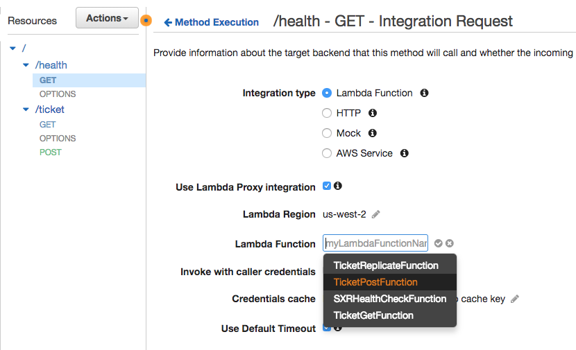

# Testing failover

It is one thing to configure failover but to have real confidence in our
setup, we need to test it. In this module we will artifically break our
primary region and observe our failover in action.

To demonstrate this we will replicate a scenario where a developer
accidentally deploys incorrect code to our healthcheck, thus breaking it.

## Breaking the primary region

In the AWS Console, ensure you are in your primary region then head over to
**API Gateway**, choose your API and select the `GET` method of the `/health`
endpoint. Under **Integration Request** change the associated Lambda function
to instead be your *TicketPostFunction*. Click the tick next to it to save the
change. This function expects to be called with a JSON body containing new
ticket information however when triggered by the health endpoint it will not
have this and will fail and return an error code.

Under **Actions** select **Deploy** to redeploy your API to the `prod` stage.

## Verifying the failure

Now head over to **Route53** and select **Health checks**. Within a few
minutes, your health check should turn from green to red and display a
failure.

Since your DNS records are configured to use this health check, Route53 should
automatically use this information to point your domain at your secondary
region.

You should now be able to visit the `api.` prefix of your domain (remember to
use HTTPS). Go to the `/health` path and notice how it now returns the
Singapore region indicating that our Secondary region is being served and that
failover has occurred. You're UI should also continue to function and you
should still be able to view and create tickets.

## Completion

Congratulations! You have now setup and verified an API that fails over from
one region to another automatically in the event of a disaster. Wild Rydes
users are going to love this!

The application you have built includes many components that you would need to
build your own Serverless applications in AWS including [AWS
Cognito](https://aws.amazon.com/cognito) for authentication, [AWS
Lambda](https://aws.amazon.com/lambda) for compute, [Amazon API
Gateway](https://aws.amazon.com/apigateway) for exposing an HTTP interface and
[DynamoDB](https://aws.amazon.com/dynamodb) for storing application data. A
good next step would be to start modifying this application to add your own
features and explore these services further.

Want to read this over again? [Go back to the beginning](../README.md)
