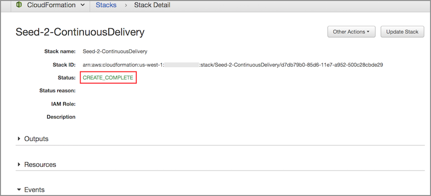
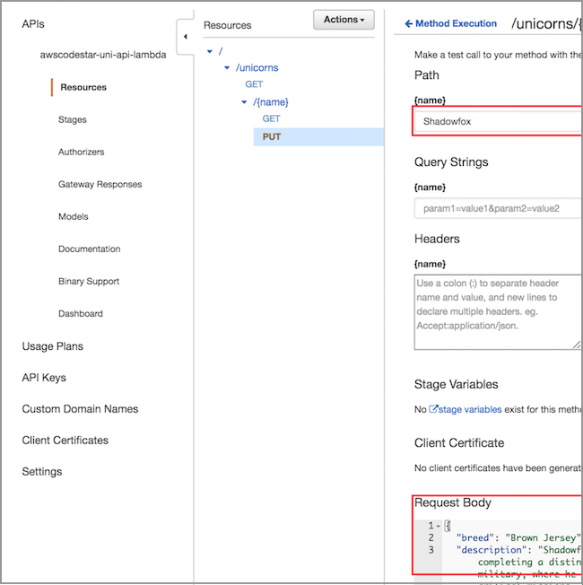
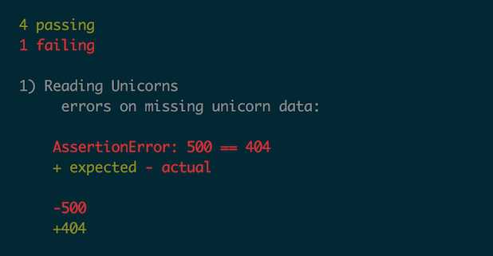
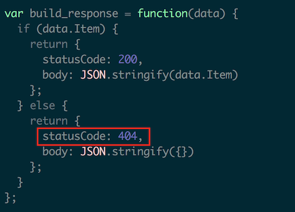
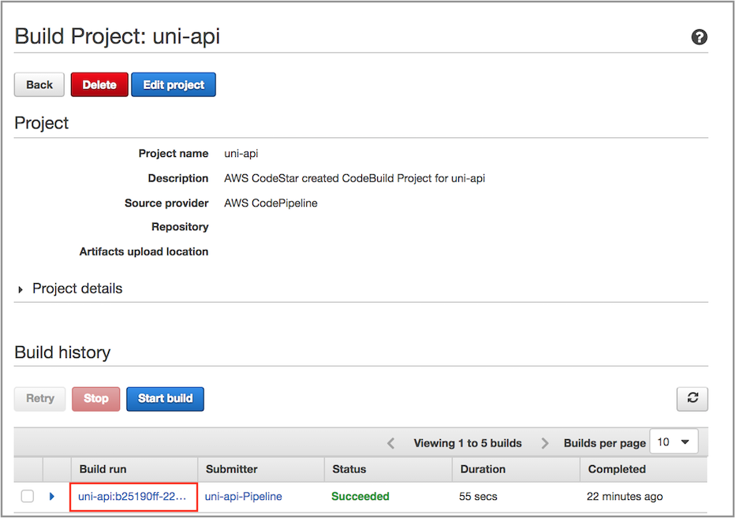
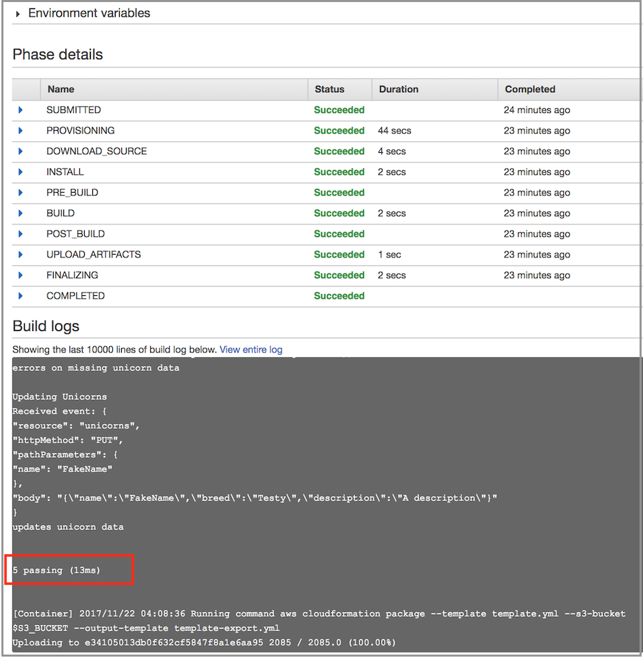

# Module 2: Continuous Delivery Pipeline

In this module, you'll use [AWS CodePipeline](https://aws.amazon.com/codepipeline/), [AWS CodeBuild](https://aws.amazon.com/codebuild/), and [Amazon S3](https://aws.amazon.com/s3/) to build a Continuous Delivery pipeline to automate a code deployment workflow for the Unicorn API.

## CodePipeline Overview

CodePipeline orchestrates the steps to build, test, and deploy your code changes.  Below is a screenshot of the CodePipeline created by the CodeStar project.


## CodeBuild Overview

CodeBuild compiles source code, runs tests, and produces software packages that are ready to deploy to environments.

The Unicorn API [buildspec.yml](uni-api/buildspec.yml) defines the commands used to build the project and the output artifacts.

```yaml
version: 0.1

phases:
  build:
    commands:
      - cd app && npm install
      - aws cloudformation package --template template.yml --s3-bucket $S3_BUCKET --output-template template-export.yml

artifacts:
  type: zip
  files:
    - template-export.yml
```

The **CloudFormation [package](http://docs.aws.amazon.com/cli/latest/reference/cloudformation/package.html)** command zips the local source code, uploads it to S3, and returns a new CloudFormation template that has been modified to use the S3 references as the CodeUri.

For the Unicorn API, the output artifact is a zip archive that includes only the `template-export.yml` file.

## Environment Setup

Each of the following sections provide an implementation overview and detailed, step-by-step instructions. The overview should provide enough context for you to complete the implementation if you're already familiar with the AWS Management Console or you want to explore the services yourself without following a walkthrough.

If you're using the latest version of the Chrome, Firefox, or Safari web browsers the step-by-step instructions won't be visible until you expand the section.

### 1. Seed the `uni-api` CodeCommit Git repository

1. Each module has corresponding source code used to seed the CodeStar CodeCommit Git repository to support the workshop.  To seed the CodeCommit Git repository, click on the **Launch Stack** button for your region below:

    Region| Launch
    ------|-----
    EU (Ireland) | [](https://console.aws.amazon.com/cloudformation/home?region=eu-west-1#/stacks/create/review?stackName=Seed-2-ContinuousDelivery&templateURL=https://s3.amazonaws.com/fsd-aws-wildrydes-eu-west-1/codecommit-template.yml&param_sourceUrl=https://s3-eu-west-1.amazonaws.com/fsd-aws-wildrydes-eu-west-1/uni-api-2-v2.zip&param_targetRepositoryName=uni-api&param_targetRepositoryRegion=eu-west-1)
    Asia Pacific (Sydney) | [](https://console.aws.amazon.com/cloudformation/home?region=ap-southeast-2#/stacks/create/review?stackName=Seed-2-ContinuousDelivery&templateURL=https://s3.amazonaws.com/fsd-aws-wildrydes-ap-southeast-2/codecommit-template.yml&param_sourceUrl=https://s3-ap-southeast-2.amazonaws.com/fsd-aws-wildrydes-ap-southeast-2/uni-api-2-v2.zip&param_targetRepositoryName=uni-api&param_targetRepositoryRegion=ap-southeast-2)


1. The CloudFormation template has been prepopulated with the necessary fields for this module.  No changes are necessary

1. Select the **I acknowledge that AWS CloudFormation might create IAM resources.** checkbox to grant CloudFormation permission to create IAM resources on your behalf

1. Click the **Create** button in the lower right corner of the browser window to create the CloudFormation stack and seed the CodeCommit repository.

    

1. There will be a short delay as the Git repository seeded with the new source code.  Upon successful completion, the CloudFormation will show Status ``CREATE_COMPLETE``.

    

### 2. Fetch CodeCommit Git Repository

Now that the CodeCommit Git repository has been seeded with new source code, you will need to fetch the changes locally so that you may modify the code.  Typically, this is accomplished using the `git pull` command, however for the workshop we have replaced the repository with a new history and different Git commands will be used.

Using your preferred Git client, run the commands from your local **uni-api** directory:

```bash
git fetch --all
git reset --hard origin/master
```

Congratulations, your environment setup is complete!


## API Enhancement

Let's enhance the API with the ability to create or update a Unicorn in the Wild Rydes stables.  The code to do so is already present in the project, so you need to add an **AWS::Serverless::Function** resource in the SAM `template.yml` template.

### 1. Add Update Function to template.yml

**Goal**: Using the `AWS::Serverless::Function` definitions in the `template.yml` file as examples, add a new Serverless Function named **uni-api-update** to the `template.yml` SAM template.  The function should invoke the **lambda_handler** method in the **`app/update.js`** file when triggered by an **Api** event to the URL path **/unicorns/{name}** using the HTTP **put** method.  The function will required an environment variable, named **TABLE_NAME** that has a value referring to the `AWS::Serverless::SimpleTable` defined in the template.

<details>
<summary><strong>
HOW TO update template.yml with uni-api-update Lambda function (expand for details)
</strong></summary>
<p>

Using a text editor, open the `template.yml` file and append a new **AWS::Serverless::Function** Resource labeled `UpdateFunction` that has the following definition.

> Note: whitespace is important in YAML files.  Please verify that the configuration below is added with the same space indentation as the CloudFormation Resources in the template.yml file.

1. **FunctionName** is `uni-api-update`

1. **Runtime** is `nodejs6.10`

1. **CodeUri** is `app`

1. **Handler** is `update.lambda_handler`

1. **Description** is `Update a Unicorn`

1. **Timeout** is `10`

1. **Event** type is `Api` associated to the `/unicorns/{name}` **Path** and `put` **Method**

1. **Environment** variable named `TABLE_NAME` that references the `Table` Resource for its value.

1. **Role** is duplicated from another function.

   If you are unsure of the syntax to add to ``template.yml`` please refer to the code snippet below.

   <details>
   <summary><strong>template.yml additions to support Update function (expand for details)</strong></summary><p>

   ```yaml
     UpdateFunction:
       Type: 'AWS::Serverless::Function'
       Properties:
         FunctionName: 'uni-api-update'
         Runtime: nodejs6.10
         CodeUri: app
         Handler: update.lambda_handler
         Description: Update Unicorn
         Timeout: 10
         Events:
           PUT:
             Type: Api
             Properties:
               Path: /unicorns/{name}
               Method: put
         Environment:
           Variables:
             TABLE_NAME: !Ref Table
         Role:
           Fn::ImportValue:
             !Join ['-', [!Ref 'ProjectId', !Ref 'AWS::Region', 'LambdaTrustRole']]
   ```
   </details>
   
</details>
<p>

Now that you've updated the the SAM template with the changes, use Git to commit the changes and push them to remote repository.  This will trigger CodePipeline to build and deploy your changes in AWS.

### 2. Commit the change to local Git repository

1. Using your Git client, add the local changes to the Git index, and commit with a message.  For example:

    ```bash
    git add -u
    git commit -m "Add update function"
    ```

1. Using your Git client, push the Git repository updates to the origin.  For example:

    ```bash
    git push origin
    ```

### 3. Confirm CodePipeline Completion

**Goal**: After pushing your changes to your CodeCommit Git repository, use the AWS CodeStar Console to monitor and confirm that the changes are successfully built and deployed using CodePipeline.

<details>
<summary><strong>
HOW TO use the CodeStar Console to monitor CodePipeline (expand for details)
</strong></summary>
<p>

1. In the AWS Management Console choose **Services** then select **CodeStar** under Developer Tools.

1. Select the `uni-api` project

    

1. Observe that the continuous deployment pipeline on the right of the browser window now shows the Source stage to be blue, meaning that it is active.

    

1. Each stage's color will turn blue during execution and green on completion.  Following the successful execution of all stages, the pipeline should look like the following screenshot.

    
</details>
<p>

Congratulations, your changes were successfully built and deployed using CodePipeline.  Next, let's validate that you're able to use the API to add a Unicorn to the Wild Rydes Stable.

## Enhancement Validation

After the CloudFormation deploy command completes, you will use the AWS API Gateway to test your API.

### 1. Add a Unicorn

1. In the AWS Management Console, click **Services** then select **API Gateway** under Application Services.

1. In the left nav, click on `awscodestar-uni-api-lambda`.

1. From the list of API resources, click on the `PUT` link under the `/{name}` resource.

1. On the resource details panel, click the `TEST` link in the client box on the left side of the panel.

    

1. On the test page, enter `Shadowfox` in the **Path** field.

1. Scroll down the test page and enter the following as the **Request Body**:

    ```json
    {
      "breed": "Brown Jersey",
      "description": "Shadowfox joined Wild Rydes after completing a distinguished career in the military, where he toured the world in many critical missions. Shadowfox enjoys impressing his ryders with magic tricks that he learned from his previous owner."
    }
    ```

    

1. Scroll down and click the **Test** button.

1. Scroll to the top of the test page, and verify that on the right side of the panel that the **Status** code of the HTTP response is 200.

    

Congratulations, you have used the API to successfully add a Unicorn!  Next, use the API to list the Unicorns and confirm Shadowfox is included.

### 2. List Unicorns

1. In the AWS Management Console choose **Services** then select **CodeStar** under Developer Tools.

1. Select the `uni-api` project

    

1. Copy the URL from the **Application endpoints** tile on the right side of the dashboard.

    

1. Paste the URL in a browser window and append `/unicorns` to the path and hit enter.  For example: `https://xxxxxxxxxx.execute-api.us-east-1.amazonaws.com/Prod/unicorns/`

1. Confirm that the browser shows a JSON result that includes `Shadowfox`, with the breed and description entered above.


## Unit Testing our API

Now that we have a working API, let's consider what steps we can take to ensure that we prevent bugs from creeping into our code.  As you can see, manual testing of our API has a couple of issues; we have to wait for the build process to complete and it takes a human being to go through the steps to verify the API works using the API Gateway service. It would be faster and more reliable to have an automated process that can perform this verification, and it would be even better to have these checks integrated into our build processes.

The repository you cloned in the steps above already include a set of tests that verify the functionality of our Lambda functions, so we won't need to write them from scratch. In the below steps, we will install the tools necessary to execute these tests, fix an issue that we discover has crept into our code, and take steps to ensure these issues won't crop up again in the future.

### 1. Install the testing tools and run our unit test 

1. Change directory to your local **uni-api** directory, if you aren't already there.

1. Install the development tools needed to run unit tests using Node Package Manager:

    ```
    npm install
    ```

1. Now that the tools have been installed, let's run our unit testing tool. Since the code for this project was written in Nodejs, we're using the Mocha test framework (https://mochajs.org/). This was already registered in our `package.json` file, so it was installed automatically in the previous step.

    ```
    node_modules/.bin/mocha
    ```

    Our suite of tests will then run, and we will discover that there's an issue in our code! One of our Lambda functions is not returning the correct response when we attempt to read a non-exitent unicorn's data.
    
    

### 2. Fix unit test failures

Let's examine the output of our test run. We see that the test expected that we would return the standard "404" error code if we attempted to read a unicorn that did not exist in the system, and instead our Lambda code returns a "500."

**Goal**: Correct code bug in `app/read.js`, run unit tests, and verify the tests pass.

<details>
<summary><strong>
HOW TO correct code bug and verify passing unit test (expand for details)
</strong></summary>
<p>

1. Using a text editor, open `app/read.js` and navigate to the end where we construct our response. We will see that, where we specify the status code to return, we use the existence of a retured item to determine whether we return a 200 (OK) or a 500 (server error) code.

1. Change the code to return a 404 (resource not found) status code instead of a 500.

   

1. Now that we have fixed our code, let's verify the behavior by re-running our unit testing tool:

    ```
    node_modules/.bin/mocha
    ```

1. Verify that there are no errors reported by our test run.

   

</details>
<p>

Congratuations, you've successfully corrected the code bug!  Next, let's look at how to run these tests as part of CodePipeline.


### 3. Ensure our tests are run during our builds

Having this testing framework in place ensures that the exact same set of steps are run every time we test our code. However, we are still running this test manually. Let's configure our CodeBuild environment to run these tests for us every time a build is performed.

1. Using a text editor, open `buildspec.yml` and navigate to the `build:` section. 

1. We have discovered that our nemesis, Chet, has disabled our unit tests! Why, Chet, why?! To fix this, uncomment the line that executes the `mocha` command so our unit tests will be run during the build.

1. Using your Git client, add the local changes to the Git index, commit these changes with a message, and push our local changes to the repository. For example:

    ```bash
    git add -u
    git commit -m "Enabled unit tests and fixed issues"
    git push
    ```
    
### 4. Verify the tests are run during the build

1. In the AWS Management Console choose **Services** then select **CodeStar** under Developer Tools.

1. Select the `uni-api` project

    

1. Scroll down to the "Commit history" tile and verify that you see the commit message that you entered above, for example "Enabled unit tests and fixed issues".

    

1. Monitor the "Continuous Deployment" pipeline to ensure that the most recent execution of the Build step took place after you committed the code in the steps above. If you have just committed your changes it may take a few minutes for your changes to be detected and executed.

1. Once the Build step has completed, click the `CodeBuild` link inside the step to view the CodeBuild project and build history.

    

1. Scroll down to the "Build History" section, and click the entry for the most recent build to view the details of the build.

    

1. Scroll down to the Build logs section, and inspect the build log, looking for a section that begins with `Running command mocha` and reports the results of the test pass (should be `5 passing`).

    

Congratulations, you have successfully integrated unit tests into your continuous delivery process!

## Completion

You have successfully used a Continuous Delivery Pipeline using CodePipeline to automate the deployment of the Unicorn API. In the next [X-Ray Module](../3_XRay), you will integrate AWS X-Ray to demonstrate how to troubleshoot the Unicorn API.
