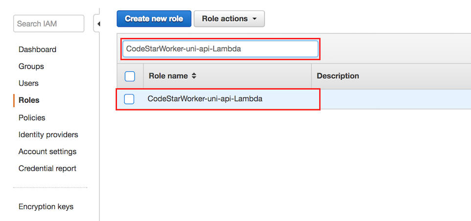
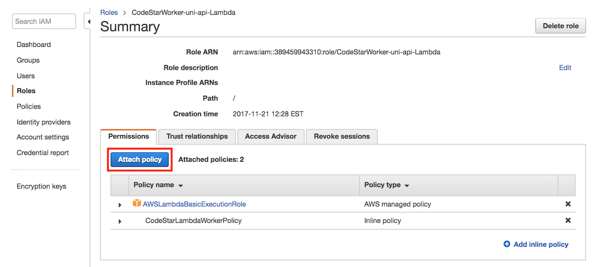
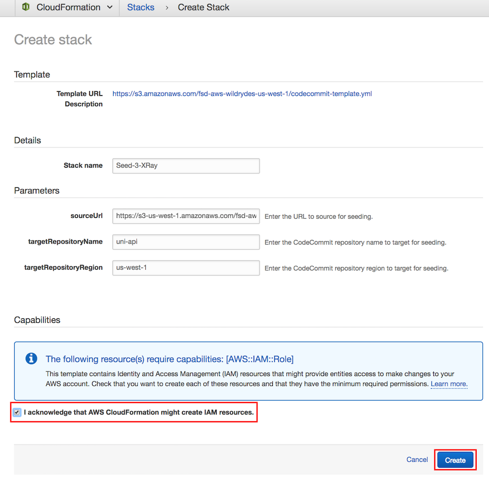
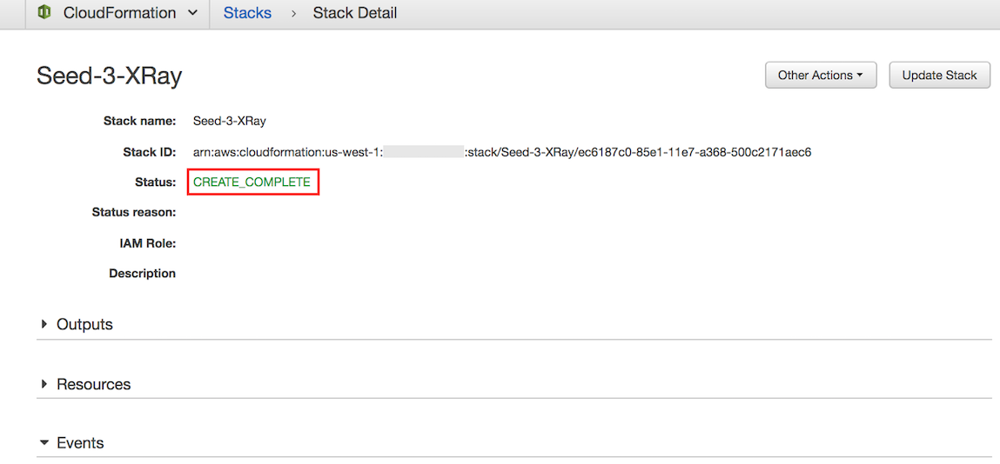
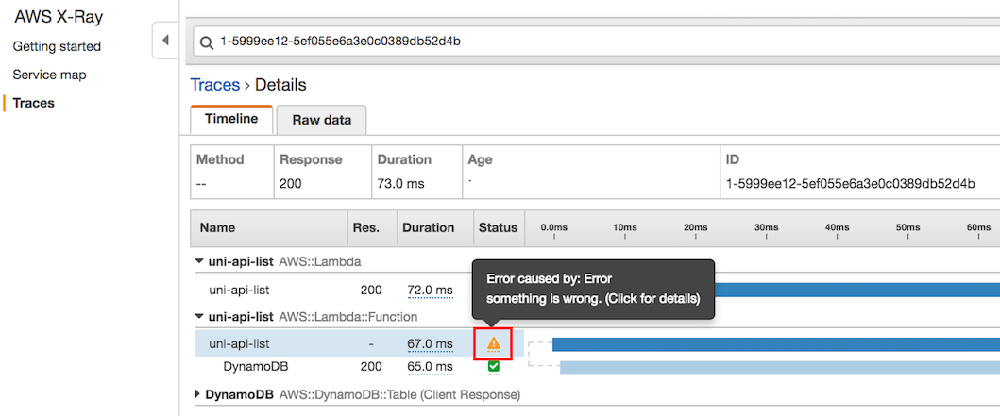
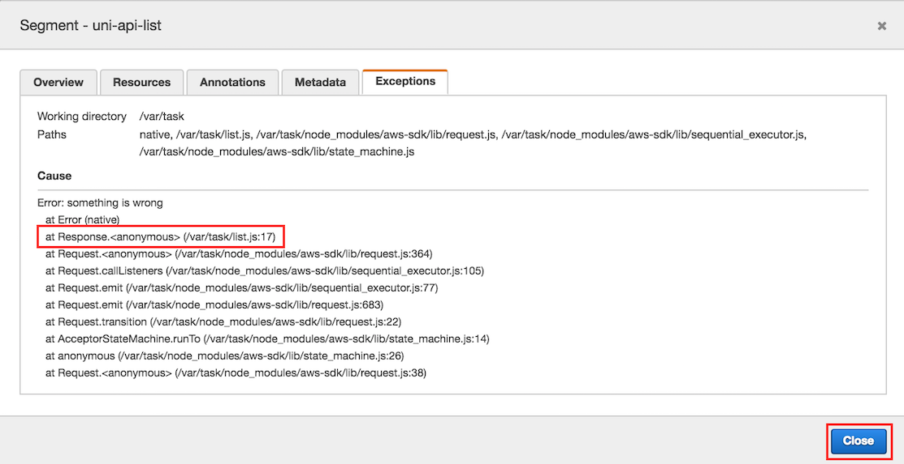
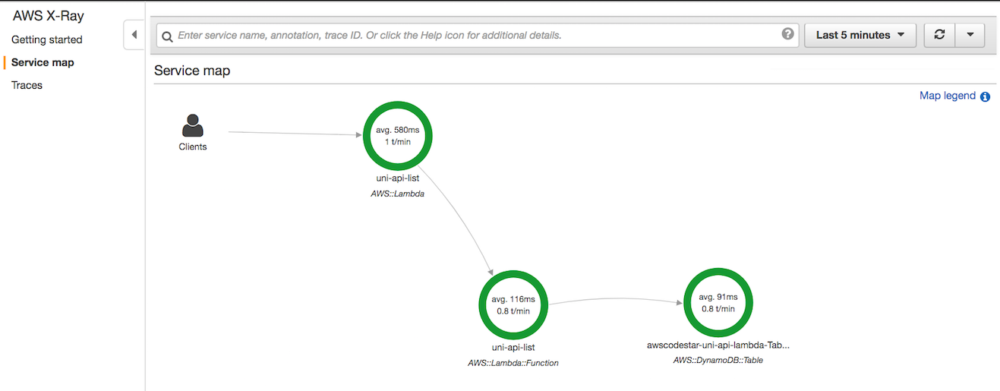

# 모듈 3: AWS X-Ray 연동

이번 모듈에서는 이전 모듈 [Module 2: Continuous Delivery Pipeline](../2_ContinuousDeliveryPipeline)에서 생성한 [AWS CodePipeline](https://aws.amazon.com/codepipeline/)을 통해 배포한 Unicorn API를 [AWS X-Ray](https://aws.amazon.com/xray/)를 이용하여 분석하고 디버깅하는 방법에 대해서 알아 보도록 하겠습니다.

## AWS X-Ray 개요

[AWS X-Ray](https://aws.amazon.com/xray/) 여러분의 분산 어플리케이션들의 분석 및 운영과정의 디버깅을 용이하게 해주는 도구 입니다. X-Ray를 이용하면 여러분의 프로그램이 어떻게 동작하는지 그리고 어떠한 하위 서비스들과 연동되고 있는를 알 수 있습니다. 이를 통해 어플리케이션의 오동작과 성능저하의 참 원인을 밝히는 불량분석을 용이하게 해줍니다. X-Ray는 각 서비스들의 종단에서 어떠한 요청을 주고 받는지 또한 이러한 요청들이 어떻게 이동하는지를 보여줍니다. 또한 어플리케이션의 하위 컴포넌트들을 알기 쉽게 한눈에 보여줍니다. X-Ray는 여러분의 개발 환경 뿐만 아니라 운영환경에서도 사용할 수 있습니다.

모듈 3에서는 모듈 2에서 CodePipeline를 사용하여 배포한 Unicorn API에 버그를 삽입하여 업데이트 할 것 입니다. 또한 Unicorn API에 X-Ray가 연동되어 있으며 이 X-Ray를 이용하여 버그의 원인을 찾고 문제를 해결 할 것입니다. 버그를 수정한 뒤에는 pipeline를 통하여 수정한 코드를 배포하고 X-Ray를 통하여 문제가 제대로 고쳐졌는지 확인 할 것입니다. 다음은 Lambda함수에 X-Ray를 연동하는 법을 알아 보도록 하겠습니다.

## AWS Lambda와 AWS X-Ray 연동하기

AWS Lambda를 이용하여 생성한 서버리스 어플리케이션의 요청 메시지들을 AWS X-Ray를 이용하여 추적 할 수 있습니다. 요청을 추적함으로써 서버리스 어플리케이션의 성능향상에 도움이 되는 힌트를 제공합니다. 또한 문제가 되는 부분의 참 원인을 정확하게 포착해 낼 수도록 도와 줍니다.

Lambda에 X-Ray를 연동하게 위해서는 모듈 2에서 작성한 Unicorn API에 몇 가지 수정을 해야 합니다. 이러한 코드 수정은 모듈 3의 `uni-api`에 이미 적용되어 있습니다. 코드 수정 부분를 천천히 집어보도록 하겠습니다.

### Lambda 함수의 Active Tracing 활성화 하기

각 Lambda 함수들은 `Tracing` 속성을 추가하고 속성 값이 `Active`로 되어 있어야 지만 X-Ray를 위한 active tracing가 활성화 됩니다. ([see more](https://github.com/awslabs/serverless-application-model/blob/master/versions/2016-10-31.md#properties)).

### Lambda 함수와 AWS X-Ray SDK 연동하기

현재 Lambda 함수에서 X-Ray SDKs는 Node.js와 Java가 제공되고 있습니다. X-Ray SDK를 Node.js Unicorn API에 연동하기 위해서는 [npm](https://www.npmjs.com/)을 이용하여 [aws-xray-sdk](https://www.npmjs.com/package/aws-xray-sdk) node 모듈을 프로젝트 의존 모듈들에 추가해야 합니다. X-Ray SDK모듈은 이미 `uni-api/app` 디렉토리의 `package.json` 파일에 추가되어 있습니다. 실질적으로 이 모듈은 CodeBuild 의 빌드 스테이지에서 `uni-api/buildspec.yml`에서 새롭게 정의된 **build** 단계에서 추가될 것입니다.

```yaml
build:
  commands:
    - cd app && npm install
    - aws cloudformation package --template app-sam.yaml --s3-bucket $S3_BUCKET --output-template template-export.yml
```

추가적으로 [aws-xray-sdk](https://www.npmjs.com/package/aws-xray-sdk) 라이브러리를 추가하는 것과 더불어 어플리케이션 코드와 연동이 되어야 합니다. 아래는 X-Ray를 연동하기 전의 코드와 X-Ray가 연동된 이후의 코드 일부분을 비교를 하였습니다.

X-Ray 연동 전:

```javascript
const AWS = require('aws-sdk');
const docClient = new AWS.DynamoDB.DocumentClient();
const tableName = process.env.TABLE_NAME;
```

X-Ray 연동 후:

```javascript
const AWSXRay = require('aws-xray-sdk');
const AWS = AWSXRay.captureAWS(require('aws-sdk'));
const docClient = new AWS.DynamoDB.DocumentClient();
const tableName = process.env.TABLE_NAME;
```

보시는 바와 같이 기본적인 X-Ray 연동은 두줄의 코드 추가로 가능합니다. 첫번째는 `aws-xray-sdk`를 추가하는 줄이고 두번째는 기존의 `aws-sdk` 라이브러리를 X-Ray로 감싸도록 수정된 줄입니다. 이렇게 X-Ray로 aws-sdk를 감싸게 되면 추가적인 코드 수정없이 모든 AWS API 호출을 X-Ray를 통해 호출 됩니다.

## 구현 지침

본 모듈은 여러 섹션으로 구성되어 있으며 매 섹션 시작에는 개괄적인 개요가 준비되어 있습니다. 섹션 마다 구현을 위한 자세한 내용은 단계별 지침안에서 확인 하실 수 있으십니다. 이미 AWS Management Console에 익숙하시거나 둘러보기를 거치지 않고 직접 서비스를 탐색하시려는 분들을 위해 구현을 완료하는 데 필요한 충분한 내용을 각 섹션의 개요에서 제공하고 있습니다.

최신 버젼의 크롬, 파이어폭스, 사파리 웹 브라우저를 사용하신다면 단계별 지침을 클릭하셔서 자세한 내용을 확인하시기 바랍니다.

### 1. `CodeStarWorker-uni-api-Lambda` 역할에 AWSXrayWriteOnlyAccess 정책 추가하기

1. AWS Management 콘솔에서 **Services**를 선택한 다음 Security, Identity & Compliance 아래 **IAM**를 선택하십시오.

1. 왼쪽 네비게이션바에서 **Roles** 을 선택하고 **Filter** 입력란에 `CodeStarWorker-uni-api-Lambda`를 입력하고 해당 역할 옆의 확인란을 선택하십시오.

    
 
1. 역할 요약 페이지에서 **Permissions** 탭에서 **Managed Policies** 영역의 **Attach Policy** 버튼을 클릭하십시오.

    
 
1. **Filter** 입력 란에 `AWSXRayWriteOnlyAccess`을 입력한뒤 **AWSXRayWriteOnlyAccess**의 좌측 체크 박스를 선택하고 **Attach Policy** 버튼을 클릭하십시오.

    
 
1. 역할 요약 페이지에서 이제 **AWSXRayWriteOnlyAccess** 정책이 **Managed Policies** 리스트에 추가가 되어 있는 것을 확인하실수 있습니다.

    

### 2. `uni-api` CodeCommit 깃 저장소 시작 하기

1. 각각의 모듈은 해당 워크숍 진행에 필요한 소스 코드와 CodeStar 및 CodeCommit 깃 저장소와 연동이 되어 있습니다. 깃 저장소를 시작하기 위해서는 여러분이 선택하신 리전의 **Launch Stack** 버튼을 클릭 하여 주시기 바랍니다.

    Region| Launch
    ------|-----
    US East (N. Virginia) | [](https://console.aws.amazon.com/cloudformation/home?region=us-east-1#/stacks/create/review?stackName=Seed-3-XRay&templateURL=https://s3.amazonaws.com/fsd-aws-wildrydes-us-east-1/codestar-template.yml&param_sourceUrl=https://s3.amazonaws.com/fsd-aws-wildrydes-us-east-1/uni-api-3.zip&param_targetProjectId=uni-api&param_targetProjectRegion=us-east-1)
    US West (N. California) | [](https://console.aws.amazon.com/cloudformation/home?region=us-west-1#/stacks/create/review?stackName=Seed-3-XRay&templateURL=https://s3.amazonaws.com/fsd-aws-wildrydes-us-west-1/codestar-template.yml&param_sourceUrl=https://s3-us-west-1.amazonaws.com/fsd-aws-wildrydes-us-west-1/uni-api-3.zip&param_targetProjectId=uni-api&param_targetProjectRegion=us-west-1)
    US West (Oregon) | [](https://console.aws.amazon.com/cloudformation/home?region=us-west-2#/stacks/create/review?stackName=Seed-3-XRay&templateURL=https://s3.amazonaws.com/fsd-aws-wildrydes-us-west-2/codestar-template.yml&param_sourceUrl=https://s3-us-west-2.amazonaws.com/fsd-aws-wildrydes-us-west-2/uni-api-3.zip&param_targetProjectId=uni-api&param_targetProjectRegion=us-west-2)
    EU (Ireland) | [](https://console.aws.amazon.com/cloudformation/home?region=eu-west-1#/stacks/create/review?stackName=Seed-3-XRay&templateURL=https://s3.amazonaws.com/fsd-aws-wildrydes-eu-west-1/codestar-template.yml&param_sourceUrl=https://s3-eu-west-1.amazonaws.com/fsd-aws-wildrydes-eu-west-1/uni-api-3.zip&param_targetProjectId=uni-api&param_targetProjectRegion=eu-west-1)
    EU (Frankfurt) | [](https://console.aws.amazon.com/cloudformation/home?region=eu-central-1#/stacks/create/review?stackName=Seed-3-XRay&templateURL=https://s3.amazonaws.com/fsd-aws-wildrydes-eu-central-1/codestar-template.yml&param_sourceUrl=https://s3-eu-central-1.amazonaws.com/fsd-aws-wildrydes-eu-central-1/uni-api-3.zip&param_targetProjectId=uni-api&param_targetProjectRegion=eu-central-1)
    Asia Pacific (Sydney) | [](https://console.aws.amazon.com/cloudformation/home?region=ap-southeast-2#/stacks/create/review?stackName=Seed-3-XRay&templateURL=https://s3.amazonaws.com/fsd-aws-wildrydes-ap-southeast-2/codestar-template.yml&param_sourceUrl=https://s3-ap-southeast-2.amazonaws.com/fsd-aws-wildrydes-ap-southeast-2/uni-api-3.zip&param_targetProjectId=uni-api&param_targetProjectRegion=ap-southeast-2)


1. CloudFormation 템플레이트는 이번 모듈을 진행하는데 있어서 필요한 항목들이 사전에 정의 되어 있습니다.

1. **I acknowledge that AWS CloudFormation might create IAM resources.** 체크 박스를 체크 하여 주시기 바랍니다. CloudFormation에 여러분을 대신하여 스택 생성에 필요한 IAM 자원을 생성 할 수 있도록 권한 부여를 허락함을 의미 합니다.

1. 브라우저창의 우측 하단의 **Create** 버튼을 클릭하여 주시기 바랍니다. 이번 모듈에 필요한 CloudFormation 스택을 생성 및 CodeCommit 저장소를 생성합니다.

    

1. 깃 저장소에 새로운 코드로 준비되기 까지는 약간의 지연이 발생 할 수 있습니다. 만약 모든 것이 성공적으로 생성이 되었다면 CloudFormation의 상태는 ``CREATE_COMPLETE`` 이어야 합니다.

    

### 3. CodeCommit 깃 저장소로 부터 Fetch 하기

새로운 코드가 추가된 CodeCommit 깃 저장소가 생성되었습니다. 코드를 수정 할 수 있도록 이 저장소의 변경사항을 여러분의 로컬 깃 저장소로 복사할 것 입니다. 일반적으로 리모트 깃 저장소의 업데이트된 내용은 `git pull` 명령어로 수행할 수 있습니다. 하지만 이번 워크숍에서는 저장소의 history가 새롭게 생성 되었기 때문에 `git pull`이 아닌 다른명령어를 사용 하셔야 합니다.

여러분이 사용하시 편한 깃 클라이언트를 이용해서 아래 명령어 들을 여러분의 로컬 **uni-api** 깃 저장소에서 실행해 주시기 바랍니다.

* `git fetch --all`
* `git reset --hard origin/master`

### 4. CodePipeline Unicorn API 배포 검증

1. 저장소가 생성되면 자동적으로 pipeline이 실행 됩니다. Pipeline의 진행이 완료가되면 **Deploy** 단계가 녹색창으로 바뀌어야 합니다.


### 5. List API Method 실행하기

1. AWS Management 콘솔에서 **Services**를 선택한 다음 Developer Tools 섹션에서 **CodeStar** 를 선택하십시오.

1. `uni-api` 프로젝트를 선택 하십시오.

    

1. 상황판 오른쪽에 있는 **Application endpoints** 창에서 URL 주소를 복사하십시오.

    

1. 웹 브라우저에서 방금 복사한 URL을 붙여넣기 한뒤 주소에 `/unicorns` 를 추가해 주시기 바랍니다. 아래 주소와 같은 형식이어야 합니다. `https://xxxxxxxxxx.execute-api.us-east-1.amazonaws.com/Prod/unicorns/`

1. 웹 브라우저에서는 아래와 같은 에러를 반환해야 합니다. 브라우저에서 새로고침으로 REST API에 여러번 응답을 요구하시기 바랍니다.

   ```json
   {
     "message": "Internal server error"
   }
   ```

문제가 발생했습니다! 이번 버전의 Unicorn API에 버그가 있는 것 같습니다. 다음 단계에서는 X-Ray를 사용하여 어떠 오류가 발생했는지 확인해 보도록 하겠습니다.

## X-Ray를 이용하여 검증하기

1. AWS Management 콘솔에서 **Services**를 선택한 다음 Developer Tools 섹션에서 **X-Ray** 를 선택하십시오.

   X-Ray를 처음 사용하신다면 환영 문구를 보실수 있으시며 다음 단계로 진행하시면 됩니다. 만약에 이전에 X-Ray 프로젝트를 사용하셨다면 4단계로 넘어가 주시기 바랍니다.

1. **Get started**를 클릭하시기 바랍니다.

    

1. **Cancel**를 클릭하시기 바랍니다.

    

1. X-Ray 콘솔이 열리며 좌측 네비게이션창의 **Service map**을 선택하시기 바랍니다. 아래 화면과 유사한 화면이 보여야 합니다.


**중요!**
> X-Ray가 API 요청을 분석 처리하는데 시간의 소요됩니다. 따라서 약간의 지연이 발생할 수 있습니다. 현재 창에서 위의 그림과 같은 내용이 보이지 않으신다면 새로 고침 버튼을 클릭하시기 바랍니다.

### 서비스 맵

화면에는 클라이언트(여러분의 브라우저)가 **AWS::Lambda** 자원에 연결하고 있는 것이 보이실 것 입니다. 이 작업은 Lambda 함수의 초기화 작업을 의미합니다. 두번째 연결은 **AWS::Lambda::Function**이며 `list.lambda_handler` 함수를 호출하는 것을 의미 합니다. `app-sam.yaml` 템플레이트에 정의된 Lambda 함수의 handler 입니다. 세번째 연결은 **AWS::DynamoDB::Table**이며 DynamoDB 테이블에 쿼리 작업들을 의미 합니다.

**AWS::Lambda**와 **AWS::Lambda::Function**의 오렌지 색의 원들은 서비스들간에 HTTP 요청하였을시 에러가 발생했음을 의미 합니다.

### Traces (추적)

1. 좌측 네비게이션 패널에서 **Traces**를 클릭하시기 바랍니다. 

1. **Trace Overview**의 응답 리스트를 보시면 7번의 에러가 발생했음을 알 수 있습니다.

   

1. **Trace Overview** 아래 **Trace List** 첫 번째 오렌지 색으로 표시된 Trace를 클릭하셔서 **Trace Detail** 페이지를 열어 주시기 바랍니다.

1. **Trace Detail** 페이지에서 HTTP 요청의 **Timeline**를 살펴 보시기 바랍니다. X-Ray는 API Gateway에서 시작 되었으나 다른 시스템들로의 확장되는 것을 추적 할 수 있게 합니다. **Trace Detail**의 리스트에서는 DynamoDB 테이블 바로 위의 오렌지 주의 아이콘으로 표시된 Lambda 함수는 **Error**가 발생했음을 의미 합니다. 마우스를 주의 아이콘 위로 가져 가시면 팝업 창에 `something is wrong`이란 문구를 확인 하실 수 있으십니다.

   

1. 주의 아이콘을 클릭 하여 Trace **Segment** 세부 사항을 확인 하시기 바랍니다.

   

1.  **Segment Detail**에서 **Exception**이 발생 했음을 확인 할 수 있습니다. `list.js` **line 17**에서 에러가 발생한 원인이었음을 알 수 있습니다. 다음은 버그를 찾고 수정 하도록 하겠습니다.

1. **Close** 버튼을 클릭하여 창을 닫아 주시기 바랍니다.

다음에서는 버그를 찾고 수정 하도록 하겠습니다.

## Remediation

### 1. 코드 버그 수정하기

1. 로컬 컴퓨터에서 `app/list.js` 파일을 연다음 17번째 줄로 이동하시기 바랍니다. 아래와 같은 코드를 보실 수 있습니다.

   ```
   docClient.scan(params, function(error, data) {
     // Comment or Delete the following line of code to remove simulated error
     error = Error("something is wrong");
   ```

1. 코드 버그의 수정을 위해 17번째 줄을 주석 처리 하시거나 삭제 하시기 바랍니다.

1. `app/list.js` 파일을 저장하시기 바랍니다.

### 2. 변경 사항을 로컬 깃 레포지토리에 커밋 하기

1. 깃 클라이언트를 이용하여 로컬 변경 사항을 깃에 저장 하시고 커밋을 하시기 바랍니다. 예를 들면:

    ```
    %> git add .
    %> git commit -m "Fix bug"
    ```

1. 깃 클라이언트를 이용해서 업데이트 사항을 origin에 푸쉬 하시기 바랍니다. 예를 들면:

    ```
    %> git push origin
    ```

### 3. CodePipeline 유니콘 API 배포 검증

코드 변경사항을 CodeStar 프로젝의 CodeCommit 깃 저장소에 푸쉬를 하신뒤 여러분은 수정한 코드가 정상적으로 빌드가 되고 배포가 되는지 CodePiepline을 통해 확인 하도록 하겠습니다.

1. AWS Management 콘솔에서 **Services**를 선택한 다음 Developer Tools 섹션에서 **CodeStar** 를 선택하십시오.

1. `uni-api` 프로젝트를 선택 하십시오.

    

1. 웹 브라우저의 오른쪽 지속적 배포 파이프라인을 보시면 현재 Source 단계 창이 파란색(진행중)임을 확인 할 수 있습니다.

    

1. 각 단계의 창의 색갈은 실행중일때 파란색으로 바뀌고 완료가 되면 녹색으로 바뀝니다. 모든 단계를 성공적으로 마쳤다면 파이프 라인은 아래 화면과 같은 결과를 나타내야 합니다.

    
    
### 4. Unicorn API List Resource 실행하기

1. AWS Management 콘솔에서 **Services**를 선택한 다음 Developer Tools 섹션에서 **CodeStar** 를 선택하십시오.

1. `uni-api` 프로젝트를 선택 하십시오.

    

1. 상황판 오른쪽에 있는 **Application endpoints** 창에서 URL 주소를 복사하십시오.

    

1. 웹 브라우저에서 방금 복사한 URL을 붙여넣기 한뒤 주소에 `/unicorns` 를 추가해 주시기 바랍니다. 아래 주소와 같은 형식이 되어야 합니다. `https://xxxxxxxxxx.execute-api.us-east-1.amazonaws.com/Prod/unicorns/`

1. 웹 브라우저에서는 아래와 같이 더 이상 에러를 반환하지 않아야 합니다. 브라우저에서 새로고침으로 REST API에 여러번 응답을 요구하시기 바랍니다.

   ```json
   [ ]
   ```

API가 정상적으로 응답을 하도록 버그가 수정되었습니다. X-Ray를 이용하여 API의 동작을 검증 하도록 하겠습니다.

## X-Ray를 이용하여 버그 수정 검증하기

1. AWS Management 콘솔에서 **Services**를 선택한 다음 Developer Tools 섹션에서 **CodeStar** 를 선택하십시오.

1. X-Ray 콘솔이 열리면서 아래 화면과 유사한 서비스 맵을 보실 수 있으 실 것 입니다.



**중요!**
> X-Ray가 API 요청을 분석 처리하는데 시간의 소요됩니다. 따라서 약간의 지연이 발생할 수 있습니다. 현재 창에서 위의 그림과 같은 내용이 보이지 않으신다면 새로 고침 버튼을 클릭하시기 바랍니다.

## 완료

축하합니다! 여러분은 성공적으로 AWS X-Ray를 서비스에 연동시키셨습니다. 또한 X-Ray를 사용하여 오류를 찾아 낸 다음 복구 하셨습니다. 다음 [Multiple Environments Module](../4_MultipleEnvironments) 모듈에서는 파이프라인에 베타 단계를 추가하여 운영 환경에 배포하기전 베타 테스트를 할 수 있도록 파이프라인을 업데이트 하도록 하겠습니다.
