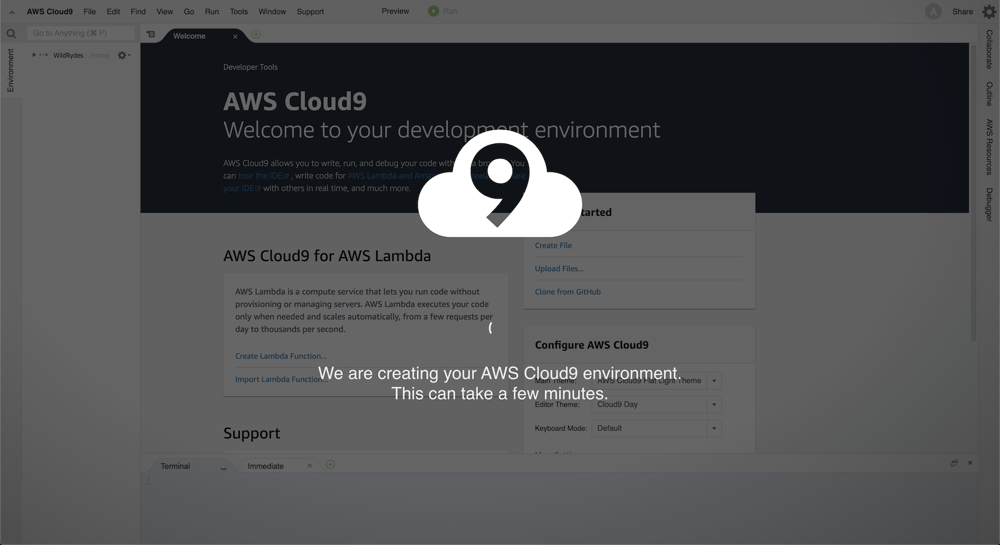

# Set up your development environment

**Time to complete:** 5-10 minutes.

## What are we building?

We are going to use [AWS Cloud9](https://aws.amazon.com/cloud9/) as our cloud-based integrated development environment. It will get you bootstrapped with the right tools and access on Day 1.

### Step 1: Create a Cloud9 environment

<details>
<summary><strong>Expand if you want detailed directions</strong></summary><p>

Create your Cloud9 instance by following these steps:

1. Navigate to AWS Cloud9 [in the console](https://console.aws.amazon.com/cloud9)
1. Click **Create environment**
1. Provide a name: **WildRydesIDE**
1. Click **Next step**
1. Leave all defaults
1. Click **Next step**
1. Click **Create environment**

</p></details>

### Step 2: Wait for your environment to be already

Your AWS Cloud9 environment is being created and your screen will look like this:



After a minute or so, your environment will be ready and you can continue.

### Step 3: Validate your environment has credentials

1. Find the "Welcome" tab and click the plus icon next to it
1. Select **New Terminal**
1. Run a command to get the caller identity: `aws sts get-caller-identity`
    * *This command will let you know who you are (account number, user ID, ARN)*

*Hint: New editors and terminals can be created by clicking the green "+" icon in a circle*


### Step 4: Clone this repository

Let's get our code and start working. Inside the terminal:

1. Run the following command to get our code:
    ```
    git clone https://github.com/jmcwhirter/aws-serverless-workshops/
    ```
1. Navigate to our workshop:
    ```
    cd aws-serverless-workshops/MachineLearning/
    ```

At this point we have built our cloud based development environment, verified it is configured with the right credentials, and copied down some source code from a code repository.

## Next step:

We're ready to proceed with building the [data processing pipeline](../1_DataProcessing).
