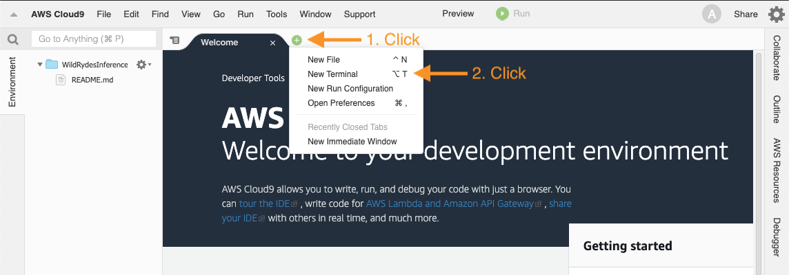

## Set up your development environment

We are going to use AWS Cloud9 as our cloud-based integrated development environment. It will get you bootstrapped with the right tools and access on Day 1.

**Time to complete:** 15-20 minutes.

**:metal: Figure It Out**
1. Create a Cloud9 environment
1. Clone this repository
1. Explore the workshop contents

<details>
<summary><strong>:white_check_mark: Hold My Hand (expand for details)</strong></summary><p>
Create your Cloud9 instance by following these steps:

1. Navigate to AWS Cloud9 [in the console](https://console.aws.amazon.com/cloud9)
1. Click **Create environment**
1. Provide a name: **WildRydesInference**
1. Click **Next step**
1. Leave all defaults
1. Click **Next step**
1. Click **Create environment**

After a minute or so, your environment will be ready. Go ahead and:

1. Find the "Welcome" tab and click the plus icon next to it
    
1. Select **New Terminal**
1. Run a command to get the caller identity: `aws sts get-caller-identity`
    * *This command will let you know who you are (account number, role, etc)*

*Hint: New editors and terminals can be created by clicking the green "+" icon in a circle*

Let's get our code and start working. Inside the terminal:

1. Run the following command to get our code:
    ```
    git clone https://github.com/jmcwhirter/aws-serverless-workshops/
    ```
1. Navigate to our module:
    ```
    cd aws-serverless-workshops/MachineLearning/0_ExternalData/
    ```
1. Explore the directory structure:
    * The `cloudformation` directory contains CloudFormation templates we will use to create resources
    * The `data` directory contains ride data collected from unicorns
    * The `lambda-functions` directory contains all of the code we'll use to process data and make inferences
    * The `notebooks` directory contains a linear learner iPython notebook

</p></details>

**:see_no_evil: Do it For Me (not available)**
