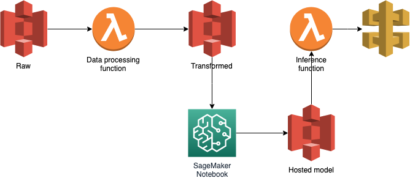

# Module 1: The first example module

Source for [internal Draw.IO](https://drawio.corp.amazon.com): [diagram xml](assets/WildRydesML.xml)

This is an example module. The page title should include the module number and a short but descriptive title.

You should provide an introductory paragraph that sets some context for the use case to be covered. If possible this should tie into the Wild Rydes theme/company story.

You should also provide instructions here for launching a CloudFormation template that allows students to skip ahead to the next module. You should host your templates in local S3 buckets in each supported region and provide a table with links for launching the templates in each region:

Region| Launch
------|-----
US East (N. Virginia) | 
US West (Oregon) | 

<strong>CloudFormation Launch Instructions (expand for details)</strong>

1. Click the **Launch Stack** link above for the region of your choice.

1. Click **Next** on the Select Template page.

1. Provide a globally unique name for the **Website Bucket Name** such as `wildrydes-yourname` and click **Next**.
    

1. On the Options page, leave all the defaults and click **Next**.

1. On the Review page, check the box to acknowledge that CloudFormation will create IAM resources and click **Create**.
    

    This template uses a custom resource to copy the static website assets from a central S3 bucket into your own dedicated bucket. In order for the custom resource to write to the new bucket in your account, it must create an IAM role it can assume with those permissions.

1. Wait for the `wildrydes-webapp-1` stack to reach a status of `CREATE_COMPLETE`.

1. With the `wildrydes-webapp-1` stack selected, click on the **Outputs** tab and click on the WebsiteURL link.

1. Verify the Wild Rydes home page is loading properly and move on to the next module, [User Management](../2_UserManagement).

## Solution Architecture

Provide a description and architecture diagram for the solution that the students will build. Consider including a diagram and short description of the components that are created by the baseline CloudFormation template in addition to the final architecture so that students are clear on which components they will be responsible for building.

## Implementation Overview

This section should provide students with the high level steps required to complete the solution. It should enumerate all the components and major configuration tasks required, but should not get to the detail of providing step-by-step instructions for which console buttons to click, etc.

Sample:

The following provides an overview of the steps needed to complete this module. This section is intended to provide enough details to complete the module for students who are already familiar with the AWS console and CLI. If you'd like detailed, step-by-step instructions, please use the heading links to jump to the appropriate section.

*Create an S3 Bucket* - Use the console or CLI to create an S3 bucket. If you'd like to use a custom domain to host the site make sure you name your bucket using the full domain name (e.g. wildrydesdemo.example.com). Read more about custom domain names for S3 buckets here.

*Upload content* - Copy the content from the example bucket, xyz. There is also a zip archive available at xyz that you can download locally and extract in order to upload the content via the console.

*Add a bucket policy to allow public reads* - Bucket policies can be updated via the console or CLI. You can use the provided policy document or build your own. See the documentation for more information.

*Enable public web hosting*
