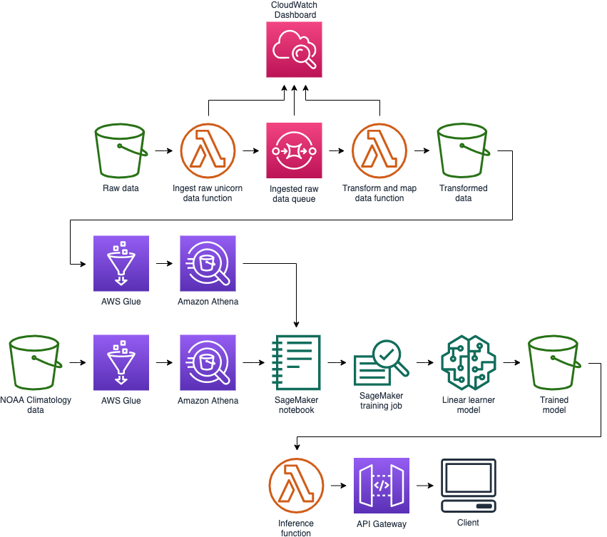

# Serverless Inference Workshop

Welcome to the Wild Rydes Unicorn Efficiency team! We are a lean team of one; you! You'll need to wear many hats such as developer, data scientist, and operations. If you recall, [Wild Rydes](http://www.wildrydes.com/) is an app based, ride sharing service where unicorns are dispatched to get riders to their destinations faster and hassle-free.  Our ability to stay in business is largely driven by our ability to efficiently set the prices of the services we're providing to our customers.  

Our typical model is to charge customers based on the estimated number of magic points a unicorn will use during the ride.  Recently, we've been receiving anecdotal reports that some unicorns are using too many magic points based on the distance being covered.  We've collected data from these rides and need your help identifying a root cause so moving forward, we can better predict magic usage and price the service appropriately.

This module has a few difficulty levels:

* :metal: Figure It Out mode = You'll be given high level directions and you need to figure out the details.
* :white_check_mark: Hold My Hand mode = You'll be given detailed directions with little to figure out.
* :see_no_evil: Do It for Me mode = Just run some commands to get the work done.

_Time Commitment Expectations: This workshop was created to be completed in approximately 2 hours.  In "Do it For Me" mode :see_no_evil:, the workshop can be completed in roughly 30-45 minutes based on AWS experience._

## Considerations for Each Role
As the team lead on this lean team of one, you'll need to wear multiple hats.  Below are some things we'll cover from the perspective of each role:
* Developer - You'll write lambda code to stitch our ETL data pipeline together.  Each function will take advantage of a queue based system to pass messages back and forth.
* Data Scientist - You'll need to load the data into your machine learning development environment.  Once loaded, you'll massage the data to test different assumptions and ultimately use a machine learning algorithm to enable your company to predict magic usage based on estimated weather + ride stats.
* Operations - You'll need to understand how this solution is hosted.  How will it handle large batches of data?  Is the solution tightly coupled?  What does a serverless inference environment mean from an operations perspective?

## Goals

At minimum, at the end of this workshop, you should have a machine learning model hosted on AWS lambda behind an HTTP endpoint that accepts temperature, precipitation amounts, and mileage and will return a percentage likelihood that the unicorn traveling in those conditions will experience heavy utilization.

## Solution Architecture

Our plan is to create a serverless data processing pipeline using AWS Lambda, Amazon S3, and Amazon SQS. You will then use AWS Machine Learning services to train a model. Finally you will make inferences against the model using AWS Lambda so our costs are appropriately controlled.

Source for Draw.io: [diagram xml](assets/WildRydesML.xml)

## Prerequisites

Provide a list of prerequisites that are required to successfully complete your workshop. This should include setting up an AWS account (note if you support multiple students sharing a single account), installing and configuring the CLI, and setting up any other tools students may need. Additionally, if there are specific skills or technologies students need to have existing knowledge of, you should list those here.

Add a subsection for each prerequisite.

Supported regions:
* us-east-1 (N. Virginia)
* us-east-2 (Ohio)
* us-west-2 (Oregon)
* ap-southeast-1 (Singapore)
* ap-northeast-1 (Tokyo)
* eu-central-1 (Frankfurt)
* eu-west-1 (Ireland)

## Modules

1. [Module 0: Setting up your development environment](0_Setup)
1. [Module 1: Build a data processing pipeline and get external data](1_DataProcessing)
1. [Module 2: Build and train a model](2_ModelBuilding)
1. [Module 3: Serverless inference](3_Inference)
