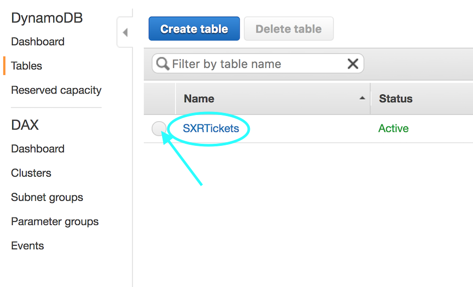
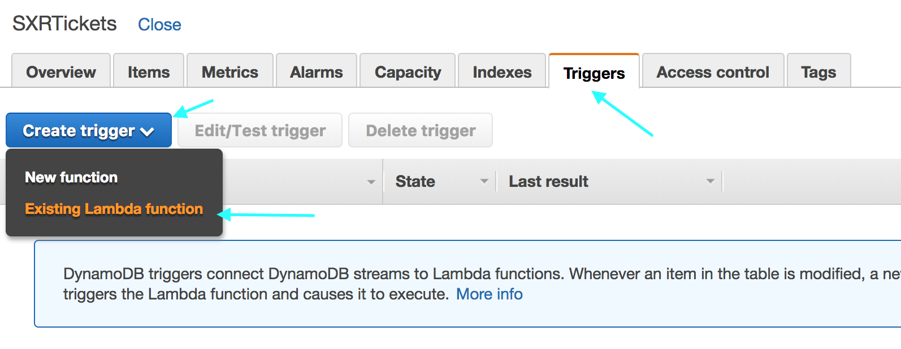
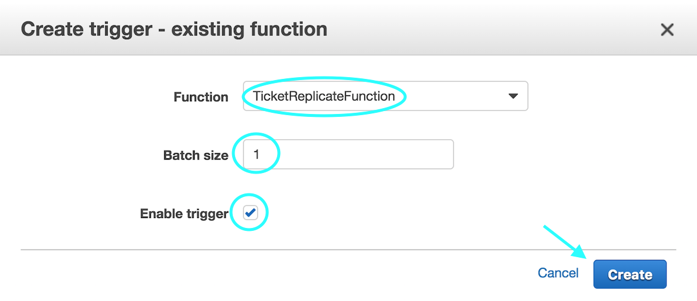
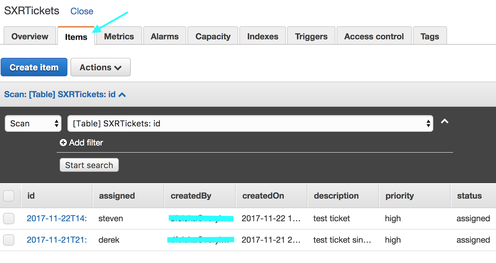
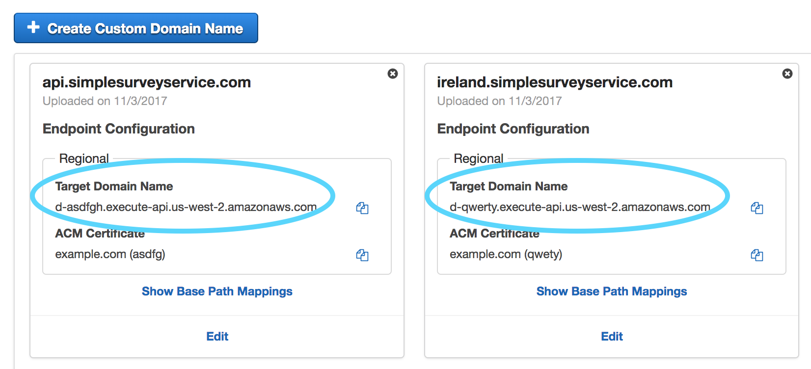
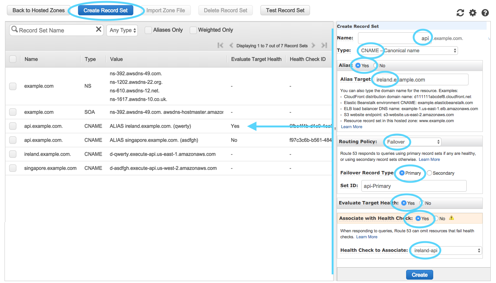

# Replicate to a second region

Now that we have the app set up, lets replicate this in a second region so we
have something to failover to. For this workshop, we will focus on the API
layer down, leaving the UI in a single region.

## 1. Replicate the primary API stack

For the first part of this module, all of the steps will be the same as module
1_API but performed in our secondary region (AP Singapore) instead. Please follow
module 1_API again then come back here. We suggest using the CloudFormation templates
from that module to make this much quicker the second time.

**IMPORTANT** Ensure you deploy only to *Singapore* the second time you go through
Module 1_API

* [Build an API layer](../1_API/README.md)

Once you are done, verify that you get a second API URL for your application from
the *outputs* of the CloudFormation template you deployed.

## 2. Replicating the data

TODO: all this can be ignored as we already created a replicated table in prior step.

So now that you have a separate stack, let's take a look at continuously
replicating the data in DynamoDB from the primary region (Ireland) to the
secondary region (Singapore) so that there is always a backup.

We will be using a feature of DynamoDB called Streams for this. DynamoDB
Streams provides a time ordered sequence of item level changes in any DynamoDB
table. This allows us to monitor these changes and push then to our second
DynamoDB table. We will be using AWS Lambda to do this since we can easily
connect this to our stream and we don't have to setup any additional
infrastructure.

During module 1, you actually already deployed a Lambda function that we can
use to push the data. All we need to do now is hook this up to DynamoDB
Streams.

In your *source* region (double check this) DynamoDB, select the SXRTickets table

Then, select *Triggers* from the tabs at the top of the screenshot
Choose **Create Trigger** and then select *Existing Lambda Function*

Choose *TicketReplicateFunction* as the Function, reduce the batch size to *1*, ensure
the *Enable* box is checked and then click **Create**

**IMPORTANT** Ensure you actually select the correct Lambda function here - it
will default to *SXRHealthCheckFunction* if you don't.

Ensure you have successfully created the trigger - you should see something like this
in your browser:

Now that you have created the replication trigger, you can test to see if it is working
by creating a new ticket in the UI you deployed in the second module.  Then, look at
the DynamoDB table in your *secondary* region, and see if you can see the record
for the ticket you just created:

Note that sometimes you need to create two tickets in order for the
*TicketReplicateFunction* to fully initialize, so if you don't see anything in the
Singapore DynamoDB table, try creating a second ticket and then check again.

## 3. Configure Route53 failover

We need a way to be able to failover quickly with minimal impact to the
customer. Route53 provides an easy way to do this using DNS and healthchecks.
Be aware that some steps in this module will take time to go into effect
because of the nature of DNS. Be patient when making changes.

NOTE: You will need the latest AWS CLI for this. Ensure you have updated
recently. See http://docs.aws.amazon.com/cli/latest/userguide/installing.html

### 3.1 Purchase (or repurpose) your own domain

In this step, you will provision your own domain name to use for this
application. If you already have a domain name registered with Route53 and
would like to use this you can use skip to the next step.  It is also possible
to delegate DNS for a domain you own with another registrar to Route53 - simply
create the zone in Route53 and then use the four DNS entries generated by
Route53 back to to delegate the zone with your existing registrar.

If using an existing domain name, ensure there is no CloudFront distribution
already setup for the domain. You will also need to ensure that your email
contacts are configured and up-to-date on the domain's SOA/registration records
since you may need to receive an approval e-mail in the next step.

For the remainder of this workshop we will use `example.com` as to
demonstrate. Please substitute your own domain into any commands or configurations.

#### High-level instructions

Navigate over to the Route53 Console and under **Registered domains** select
**Register domain** and follow the instructions. You will first have to find
an available domain before specifying your contact details and confirming the
purchase.

1. Navigate to the **Route53** service page
2. Navigate to **Registered domains**
3. Select **Register domain**
4. Enter the domain name you would like to use. You will have to choose
   something not already registered. Click **Check** and confirm that your
   domain is available before clicking **Add to cart**. Now choose
   **Continue**.
5. Enter your contact information. Ensure that you enter an email address
   where you can receive mail. By default, Route53 will enable privacy
   protection and configure an anonymized email address that forwards any mail
   onto the email address you specify. Leave this option selected and select
   **Continue**
6. Confirm that all your details are correct. Check the box agreeing to the
   terms and conditions. You will see that Route53 is verifying the email
   address you specified. Make sure you receive this email and complete the
   verification before proceeding.
7. Click **Complete Purchase**

### 3.2 Configure a certificate in Certificate Manager in each region

We will need an SSL certificate in order to configure our domain name with API
Gateway. AWS makes this simple with AWS Certificate Manager.

#### High-level instructions

Navigate over to the *Certificate Manager* service and request a new
certificate for your domain. You will specify the domain name you just created
(or repurposed). Make sure to request a wildcard certificate which includes
both `example.com` and `*.example.com`. You will have to approve the request
via email and see it as `Issued` in the console before proceeding.  You may also
approve the certificate request by creating a special DNS record  - follow those
directions if you choose/need to go this route to get the certificate approved.

Make sure to follow this same process for your second region.

1. Ensure you are in your primary region
2. Navigate to the **Certificate Manager** service page
3. Select **Request a certificate**
4. In this next step you will configure the domain name you just registered
   (or repurposed). You will want to add two domains to make sure you can
   access your site using subdomains. Add both `example.com` and
   `*.example.com`. The `*` acts as a wildcard allowing any subdomain to be
   covered by this certificate.
5. Select **Review and request**. Confirm both domains are configured and
   select **Confirm and request**
6. A validation email will be sent to the email address configured for the
   domain. Ensure that you received this email and click the validation link
   before moving on. Now click **Continue** (it is also possible to use DNS
   validation to issue the certificate as well - follow the instructions on
   the screen if you choose/need to validate this way)
7. Once you have confirmed your certificate, it will appear as `Issued` in
   your list of certificates.
8. Repeat steps 2-7 again in your second region

### 3.3 Configure custom domains on each API, in each region

Now that you have a domain name and a valid certificate for it, you can go
ahead and setup your APIs for each region to use your custom domain. API
Gateway Custom domains allow you to access your API using your own domain
name. While you can configure DNS records to point directly to the regular API
Gateway endpoint, an error will be returned unless you have this custom domain
configuration.

You will want two domain configurations in each Region. We will be using the
`api.` subdomain prefix for our application UI and `ireland.` and `singapore.`
to configure health checks and also so we can visit each region independently
for convenience.

* `eu-west-1` Ireland:
    * `api.example.com`
    * `ireland.example.com`
* `ap-southeast-1` Singapore:
    * `api.example.com`
    * `singapore.example.com`

#### High-level instructions

Navigate over to the **API Gateway** service, choose **Custom Domain Names**
then go ahead and configure a custom domain name for `api.example.com`. Make
sure to choose the **Regional** endpoint configuration. For the Base Path
Mappings you will want to choose `/` as the path, your API as the destination
and `prod` as the stage then hit **Save**. If you get an error about rate
limits, wait a minute before attempting to create again.

Now repeat for the three other subdomains in the respective regions.

Your newly-created Custom Domains will each show a Target Domain Name. You
will use this to configure your health checks and DNS records next. The final
configuration for the Ireland region should look similar to the below image.

### 3.4 Configure DNS records

Now let's start pointing your domain name at the API endpoints. In this step
you will configure CNAME records for your `ireland.` and `singapore.`
subdomains. We will not configure `api.` just yet.

#### High-level instructions

Make sure you are in your primary (Ireland) region. Head over to the
**Route53** service and select **Hosted zones**. Choose your domain name from
the list and you should see a couple of records already configured for
nameservers.

Select **Create Record Set** and create a new CNAME record for `ireland.`
pointing to the Target Domain Name for your corresponding API Gateway Custom
Domain from the previous step. You can set the TTL to 1m (60 seconds) for the
purpose of this workshop.  We recommend setting ALL DNS entries to 1m (60 seconds)
as the TTL.

Now repeat in your second region to create a CNAME for the `singapore.`
subdomain with the Target Domain Name for Singapore.

At this point you should now be able to visit your subdomain and see your API
working. Navigate to the health check endpoint on your API using your custom
domain in your web browser (e.g. `https://ireland.example.com/health`) and
ensure that you see a successful response.

This endpoint should return the region it is running in so you can also
confirm that this response region matches up with the domain you have
configured. Notice how we're explicitly using HTTPS. You will get a gateway
error if you try to use HTTP. It may take a few minutes for your records to
become active so check back later if you do not get a response as this must
work in order for your health check to function.

### 3.4 Configure a health check for the primary region

In this step you will configure a Route53 health check on the primary
(Ireland) regional endpoint. This health check will be responsible for
triggering a failover to the second region if a problem is detected in the
primary region.

Note that if you were configuring an active-active model with something like
Weighted Routing then you would configure a health check on all endpoints, but
only one is necessary in this case since only our primary region will be
handling traffic under normal conditions.

#### High-level instructions

Navigate over to the **Route53** service and choose **Health checks**. Create
a new health check, give it an easily identifyable name e.g. `ireland-api`.
Under *Monitor an endpoint*, specify the endpoint by domain name.

Since our API is protected by a TLS certificate you will need to change the
port to 443 and the protocol to HTTPS.

You will also want to specify `/health` as the path as this is where our deep
ping health check Lambda function is served from.

Before saving this health check, expand the *Advanced configuration* section, and
change the *Request Interval* to `Fast (10 seconds)` and set the failure threshold
from *3* down to *1*.  This will greatly speed up the time you need for testing
and failing over (this is not a recommended production configuration but it is
useful for speeding up the remainder of this Workshop).

Once configured, wait a few minutes and you should see your health check go
green and say Healthy in the console. Make sure this is green and healthy
before proceeding.

### 3.5 Configure DNS failover records

Now let's configure the zone records for our `api.` subdomain prefix. You will
configure these as CNAME ALIAS records in a primary/secondary failover pattern using
your health check.

#### High-level instructions

Ensure you are in your primary (Ireland) region. Navigate over to the
**Route53** service and choose **Hosted zones**. Choose the zone for your
domain and select **Create Record Set**. Enter `api` as the name and choose
CNAME as the type. Now change Alias to Yes and select the `ireland.` prefixed
version of your domain. Since this is an alias, it should appear in the
dropdown list.

Next, choose the Failover routing policy. You'll want to select the Primary
record type for your Ireland record. Turn on both Evaluate Target Health and
Associate with Health Check then select the `ireland-api` health check you
created previously. Hit **Save Record Set**.

You will now want to repeat this step again but for your Singapore domain. IMPORTANT:
You will select the Secondary record type and *not* associate with a health check
this time. Note that if you were to associate a health check with the second
region it would also be taken into consideration and if the health check was
failing in both regions then no failover would occur. By not associating the
second region with a health check, it will always be presumed to be healthy.

Your completed DNS configuration should look something like the screenshot
below.

With the DNS configured, you should now be able to visit the `api.` prefix of
your domain (remember to use HTTPS). Go to the `/health` path and notice how
it always returns the Ireland region indicating that our Primary region is
always being served.

### 3.6 Update your environments.ts file with the new API Gateway Endpoint

Now that we have completed failover testing, you will need to change the API
endpoint in your *2_UI/src/environments/environments.ts* file to use our newly
created DNS name for our API endpoint.

Edit the *environments.ts* file and use `https://api.example.com/` (substituting your
own domain) instead of the region specific name you used when setting up and
testing the UI in the second module.

**IMPORTANT** This new API Endpoint URL does NOT have `/prod/` at the end.

TODO: UPDATE YOUR C9 envrionment before running "npm run build" **** 
- C9 has node.js installed. 
- We need to use v8.12. Before running "npm install" 
- run the following: `nvm use lts/carbon` 
- run `node --version` and make sure output is v8.12.0
- NOTE: not sure how to persist this update when C9 environment is restarted.

TODO END

Ensure you run `npm run build` from the *2_UI* directory, and then upload the */dist*
contents to the S3 bucket using the same *aws s3* command you used in the second
module.

## Completion

Congratulations you have configured a multi-region API and set up a a
healthcheck-based failover using Route53. In the next module we will
intentionally break the primary region and verify that our failover to the
second works.

Module 4: [Test failover](../4_Testing/README.md)
